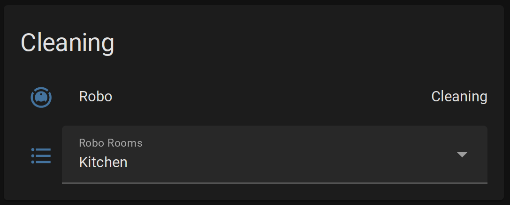

# Vacuum Homeassistant Integration with Google Assistant for Roborock Robots
This project allows to integrate basic features of a Roborock vacuum into Homeassistant via Google Home. 

Roborock is really bad at providing an open API. They only provide Alexa and Google Home integration. 

There are, however, options to extract authorization keys from Xiaomi's home app but this usually ends in not being able to use the robot in the Roborock app anymore. 

The approach of this project takes another angle. Instead of communicating with the robot directly, we use Google Home as a middle man. We send commands, that you would normally send via voice, by text to the Google Home API endpoint and interpret the result. The results are mapped to Home Assistants vacuum mqtt integration [Home Assistant Vacuum State Configuration](https://www.home-assistant.io/integrations/vacuum.mqtt/#state-configuration). 


## Tested Robots
 - Roborock S6 MaxV

## Supported Features
 - Cleaning
 - Selective room cleaning
 - Pausing/Stopping cleaning
 - Send to charger
 - Robot state (cleaning, idle, docked, returning)
 - Locating (robot say's hi)

## Unsupported features
 - Map cannot be shown in HA
 - Battery state is not available
 - Fan speed adjustment

## Installation
### Get Google credentials
First we have to get credentials to authenticate towards our Google account's Google Home
 - Follow the steps of [How to build your own smart speaker](https://medium.com/google-cloud/how-to-build-your-own-smart-speaker-google-assistant-google-cloud-actions-on-google-and-eec1169d9435) until you get your *credentials.json* file
 - Copy *credentials.json* next to *ha-vacuum.py*

### Set up virtual environment
We now build a virtual environment with all dependencies using python's venv module. 
```bash
python3 -m venv .venv
```

We need to load the virtual env 
```bash
source .venv/bin/activate
```

Now we can install the dependencies into the virutal environment using pip. 
```bash
pip install -r requirements.txt
```
### Run the integration 
Now we can run the service. 

```bash
python ha-vacuum.py
```
If everything is correctly set up, Home Assistant should automatically show the robot as a vacuum and a list of rooms to clean. 

## TODO
 - Fix documentation, there is details missing how to configure the service
 - Add parameters to the docker container
 - Add documentation how to use the docker version